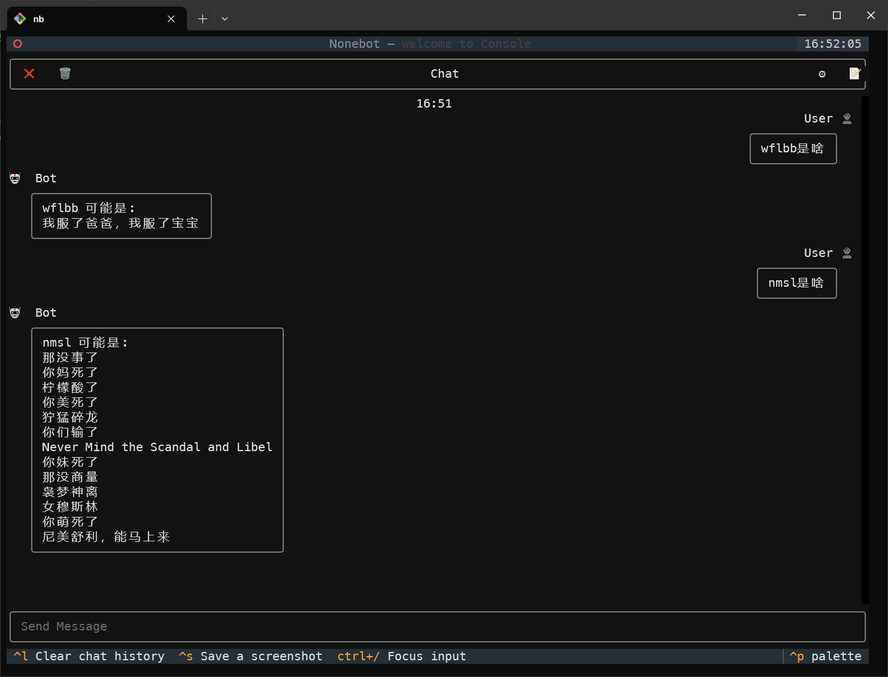

# 💎Electron Fan - NoneBot

🎃新时代·电风扇 堂堂复活！

## 🎋 如何启动

1. 运行 `pdm install`  -> [简介 - PDM](https://pdm-project.org/zh-cn/latest/)
2. 下载 [Lagrange](https://github.com/LagrangeDev/Lagrange.Core)
3. 激活当前环境 `sh ./.venv/Script/activate`
4. 复制 `.env.prod-template` 为 `.env.prod`
5. 配置 `.env.prod` , 填写超级用户等 `SUPERUSERS= ["QQ号_1", "QQ号_2"]`
6. 运行 **Lagrange**
7. 更改 Lagrange配置，设置通信端口为 `5703`. 若端口已被占用 (会显示套接字报错)，同步修改此项目配置和Lagrange配置到同一端口即可
8. 运行 `nb run`

## 🌈NoneBot Documentation

[nonebot.dev](nonebot.dev)

## 🎀 Milestones

🍒 能不能好好说话? 神奇海螺api实现的bot 缩写翻译插件 2025.2.3

